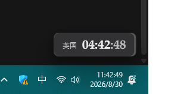
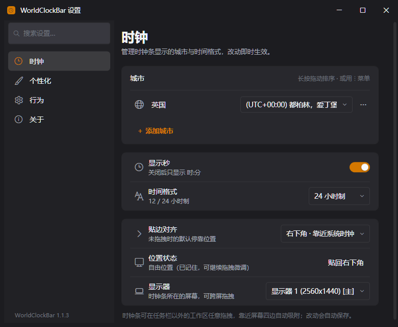
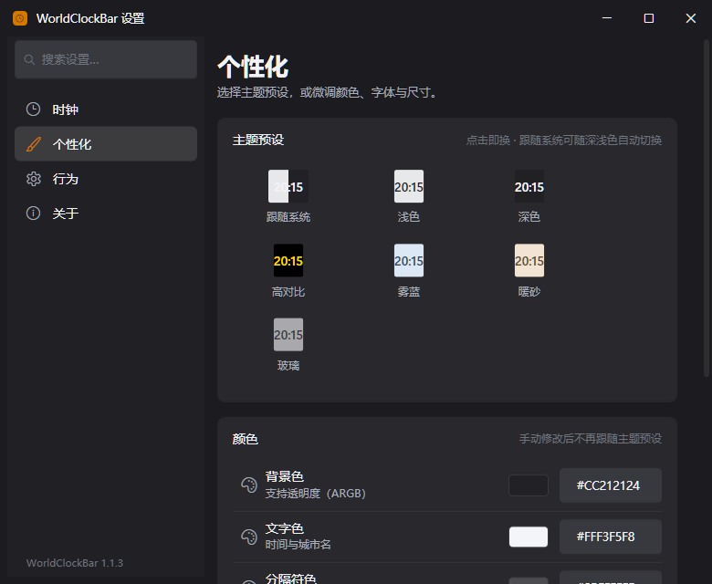

<div align="center">

# WorldClockBar

**Multi-timezone clock bar for Windows · always visible above the taskbar**

Show the current time (HH:mm:ss) of multiple countries/cities in a slim bar docked above
the taskbar. WinUI / Fluent look & feel, adapts to the system dark/light theme with the
brand teal accent, freely draggable with edge snapping. All conversions are local — **no network access**.

[English](README.en.md) · [简体中文](README.md)




</div>

> 💡 Does not inject the system taskbar / Explorer, minimizing conflicts with third-party taskbar mods.

---

## ✨ Features

| Feature | Description |
|---------|-------------|
| Multi-timezone display | Cities grouped: city name + UTC-offset badge on top, large `HH:mm` with small seconds below; tabular digits to prevent jitter |
| Fluent appearance | WinUI style: Acrylic clock bar, Mica settings window (Windows 11), automatic solid-color fallback on Windows 10 |
| Meridian brand theme | Brand teal `#0F766E`; 4 presets (Follow system / Brand light / Brand dark / High contrast) + custom colors |
| Local time conversion | Uses the system clock + `TimeZoneInfo` — **no network access** |
| Always on top | Independent topmost window; Z-order is periodically re-asserted so normal windows can't cover it |
| Free dragging | Draggable anywhere inside the **working area** (the screen area excluding the taskbar) |
| Edge snapping | Snaps to any screen edge (including above the taskbar); cannot be dragged into the taskbar |
| Live settings | Windows 11–style settings: NavigationView + grouped cards, changes apply and save instantly, searchable |
| City management | Inline rename, time-zone dropdown, ⋮ menu for reordering / deleting |
| Multi-monitor | Choose a target monitor; drag across screens |
| Auto start | Optional; writes to the current user's Run registry key |
| System tray | Branded tray icon (white / ink variants picked from the taskbar's light-dark setting); right-click → "Show clock bar" |
| Single instance | Prevents duplicate launches |

**Defaults:** United Kingdom (`GMT Standard Time`) · follow system theme · docked bottom-right

---

## 🖼️ Preview

The settings window follows the Windows 11 Settings layout (Mica material + NavigationView sidebar + rounded cards); every change applies instantly:

| Clock | Personalization |
|-------|-----------------|
|  |  |

The UI follows the Windows 11 / WinUI (Fluent Design) guidelines (brand v2):

- **Clock bar** — Acrylic strip with one group per city (city name + offset badge on top, large time + small seconds below), groups separated by 26px of whitespace instead of dividers; the local city carries a brand-teal dot; hovering a group highlights it and shows the full date and time zone
- **Settings window** — Mica material + custom-drawn title bar + brand mark above the NavigationView sidebar (Clock / Personalization / Behavior / About) + Windows 11–style rounded cards, with a brand-teal indicator bar on the selected item
- **All controls** (toggles, dropdowns, sliders, context menus, tooltips, scrollbars) restyled to Fluent appearance

Brand spec and icon assets: [docs/brand/README.md](docs/brand/README.md). Earlier three-proposal comparison: [docs/ui-redesign/design-proposals.md](docs/ui-redesign/design-proposals.md).

---

## 📦 Requirements

| Purpose | Requirement |
|---------|-------------|
| Run | Windows 10 / 11, [.NET 8 Desktop Runtime](https://dotnet.microsoft.com/download/dotnet/8.0) |
| Build / develop | [.NET 8 SDK](https://dotnet.microsoft.com/download/dotnet/8.0) |

---

## 🚀 Getting Started

### Building the exe (step by step)

**Step 1 · Install the [.NET 8 SDK](https://dotnet.microsoft.com/download/dotnet/8.0)** (skip if installed), then verify in a terminal:

```powershell
dotnet --version    # should print 8.x
```

**Step 2 · Get the source**

```powershell
git clone https://github.com/FeamCoco/FloatClock.git
cd FloatClock
```

**Step 3 · Build (quick sanity check)**

```powershell
dotnet build -c Release
```

The output lands at `src\WorldClockBar\bin\Release\net8.0-windows\WorldClockBar.exe` — double-click to run.

**Step 4 · Publish a distributable exe** (pick one)

| Mode | Command | Output size | When to use |
|------|---------|-------------|-------------|
| ① Framework-dependent | below | ≈ 0.4 MB | target machine has the [.NET 8 Desktop Runtime](https://dotnet.microsoft.com/download/dotnet/8.0) |
| ② Self-contained | below | ≈ 160 MB folder | no runtime needed on the target machine |
| ③ Self-contained single file | below | ≈ 154 MB single exe | copy one exe and it just runs |

```powershell
# ① Framework-dependent → publish\WorldClockBar.exe
dotnet publish src\WorldClockBar -c Release -r win-x64 --self-contained false -o publish

# ② Self-contained → publish-sc\WorldClockBar.exe (ships the full runtime)
dotnet publish src\WorldClockBar -c Release -r win-x64 --self-contained true -o publish-sc

# ③ Self-contained single file → publish-sf\WorldClockBar.exe (one exe, copy & run)
dotnet publish src\WorldClockBar -c Release -r win-x64 --self-contained true -p:PublishSingleFile=true -p:IncludeNativeLibrariesForSelfExtract=true -o publish-sf
```

> 💡 All three produce an install-free `WorldClockBar.exe` — just run it.
>
> 🛠️ If publish fails with `NU1100: Unable to resolve Microsoft.WindowsDesktop.App.Runtime.win-x64`, your NuGet sources are unavailable — check `dotnet nuget list source`; by default nuget.org must be reachable (or configure a mirror).

### Run during development

```powershell
dotnet run --project src\WorldClockBar -c Release
```

### Reset to defaults

```powershell
.\WorldClockBar.exe --reset
```

Restores the defaults: UK time zone + follow-system theme.

---

## 🖱️ Usage

| Action | Description |
|--------|-------------|
| **Left-drag** | Move freely within the working area; snaps near edges |
| **Double-click** | Open settings |
| **Right-click** | Settings / choose monitor / auto start / always on top / re-dock bottom-right / exit |
| **Tray icon** | Double-click to open settings; right-click for "Show clock bar" and exit |
| **Settings → Clock** | Inline rename cities, change time zone via dropdown, reorder/delete via ⋮ menu; show seconds, time format, edge alignment, monitor |
| **Settings → Personalization** | Theme preset swatches, colors, font, font size, bar height, corner radius, opacity |
| **Settings → Behavior / About** | Auto start; config file location, reset to defaults |

> All settings apply **instantly** and are saved automatically (no Apply/OK buttons).

### Design principles: why it rarely conflicts with other tools

- Does **not** modify Explorer, no Deskband / taskbar hooks
- An independent `Topmost` tool window positioned by the monitor's **WorkingArea** (the taskbar area is excluded by the system)
- Coexists with common taskbar customization tools such as StartAllBack, ExplorerPatcher, etc.

> Note: in exclusive-fullscreen scenarios (e.g. games), Windows may still cover the topmost window — this is an OS limitation.

---

## ⚙️ Configuration

Location:

```text
%AppData%\WorldClockBar\settings.json
```

Created automatically on first launch. Key fields:

```json
{
  "clocks": [
    { "label": "UK", "timeZoneId": "GMT Standard Time" }
  ],
  "appearance": {
    "themeName": "System",
    "background": "#EBFFFFFF",
    "foreground": "#FF14201E",
    "separatorColor": "#24000000",
    "fontFamily": "Segoe UI Variable Display, Segoe UI",
    "fontSize": 19,
    "opacity": 1.0,
    "barHeight": 60,
    "cornerRadius": 12,
    "horizontalAlignment": "Right",
    "offsetX": 4,
    "offsetY": 2,
    "freePosition": false,
    "posX": 0,
    "posY": 0,
    "edgeSnapDistance": 14
  },
  "monitor": { "usePrimary": true },
  "behavior": {
    "autoStart": false,
    "showSeconds": true,
    "alwaysOnTop": true,
    "timeFormat": "HH:mm:ss"
  }
}
```

| Field | Meaning |
|-------|---------|
| `clocks` | City display name + Windows time zone ID |
| `appearance.themeName` | `System` (follow OS) / `Light` (brand light) / `Dark` (brand dark) / `HighContrast` / `Custom` (colors edited manually) |
| `freePosition` / `posX` / `posY` | Free position after dragging (relative to the working area) |
| `horizontalAlignment` + `offsetX/Y` | Edge alignment when not in free position |
| `edgeSnapDistance` | Edge snap distance (DIPs) |

Old config files upgrade without modification: missing fields fall back to defaults; a missing `themeName` is treated as `System` (follow the OS dark/light theme).
The decorative presets `MistBlue` / `WarmSand` / `Glass` were removed in brand v2 — if one is present it migrates to the brand light face. `separatorColor` is kept but no longer rendered (cities are separated by whitespace instead of dividers).

Time zone IDs can be picked from the dropdown in settings — no need to type them by hand.

---

## 🔄 Auto start

Enable it in settings or the right-click menu. It writes to:

```text
HKCU\Software\Microsoft\Windows\CurrentVersion\Run\WorldClockBar
```

Turn the toggle off, or delete that registry value, to cancel.

---

## 🧱 Project structure

```text
FloatClock/
├── WorldClockBar.sln
├── README.md                    # 简体中文文档
├── README.en.md                 # English documentation
├── docs/ui-redesign/            # UI design specs & high-fidelity previews
│   ├── design-proposals.md
│   ├── mockups.html
│   └── settings-mockups.html
├── docs/images/                 # README screenshots
└── src/WorldClockBar/
    ├── App.xaml(.cs)              # Entry point, single instance, theme init
    ├── MainWindow.xaml(.cs)       # Clock bar main window (Acrylic)
    ├── SettingsWindow.xaml(.cs)   # Settings UI (NavigationView + cards, live apply)
    ├── Styles/Fluent.xaml         # Fluent control style library
    ├── Models/                    # Settings models
    └── Services/
        ├── ThemeService.cs           # Dark/light & accent detection, Mica/Acrylic
        ├── SettingsService.cs        # JSON load/save
        ├── TimeDisplayService.cs     # Time zone conversion
        ├── WindowPlacementService.cs # Positioning / dragging / edge snapping
        ├── AutostartService.cs       # Run-registry auto start
        ├── TrayIconService.cs        # System tray icon
        └── ColorHelper.cs            # Color parsing with fallback
```

Tech stack: **.NET 8 + WPF** (with WinForms helpers for `Screen`, the tray icon, and the color dialog).

**Material notes:** on Windows 11 22H2+ Mica (settings window) and Acrylic (clock bar, via `SetWindowCompositionAttribute`; automatically switches to solid color while dragging to avoid smearing) are enabled through `DwmSetWindowAttribute`. Windows 10 automatically falls back to semi-transparent solid colors with no loss of functionality. Dark/light mode and accent color follow the system in real time.

---

## ❓ FAQ

**Q: I started the app but can't see the clock bar.**
A: Check the system tray for the WorldClockBar icon → right-click → "Show clock bar". Or run with `--reset` to restore default position and styling.

**Q: Is the time accurate? Does it need internet?**
A: Time is converted entirely from your local system clock — no network. Just make sure Windows' own clock is accurate.

**Q: Can it be embedded into the system taskbar clock area?**
A: No, by design — injecting the taskbar would conflict with taskbar mods. WorldClockBar shows an independent bar docked **above** the taskbar instead.

**Q: How do I uninstall completely?**
A: Exit the app → delete the executable folder → optionally delete `%AppData%\WorldClockBar` and the Run registry value above.

---

## 📄 License

[MIT](LICENSE) — free to use, modify, and distribute.

---

## 🙏 Acknowledgments

- Windows [`TimeZoneInfo`](https://learn.microsoft.com/dotnet/api/system.timezoneinfo) for DST-aware time zone conversion
- Positioning based on the monitor **WorkingArea**, keeping the system taskbar untouched
